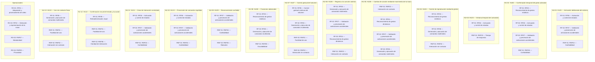

# Grafo de Dependencias -- AirDJ

_Generado automaticamente el 2026-08-22T14:33:13.796Z -- no editar a mano, se sobreescribe en cada publicacion._

```mermaid
graph TD
  subgraph US_1787347743604["HU-01: HU01 — Activación deliberada del sistema"]
    REQ_1787350078583["RF-01: RF06 — Activación y control de estados"]
    REQ_1787350165620["RF-02: RF07 — Validación y prevención de activaciones accidentales"]
    REQ_1787350197655["RNF-01: RNF04 — Confiabilidad"]
  end
  subgraph US_1787347891838["HU-02: HU02 — Confirmación temporal del gesto activador"]
    REQ_1787350392383["RF-01: RF03 — Reconocimiento de gestos estáticos"]
    REQ_1787350632161["RF-02: RF06 — Activación y control de estados"]
    REQ_1787350954278["RF-03: RF07 — Validación y prevención de activaciones accidentales"]
    REQ_1787351115597["RNF-01: RNF04 — Confiabilidad"]
  end
  subgraph US_1787348028064["HU-03: HU03 — Ventana temporal de comandos"]
    REQ_1787351185443["RF-01: RF06 — Activación y control de estados"]
    REQ_1787351228507["RNF-01: RNF03 — Tiempo de respuesta"]
  end
  subgraph US_1787348086868["HU-04: HU04 — Control de reproducción mediante gestos"]
    REQ_1787351334657["RF-01: RF03 — Reconocimiento de gestos estáticos"]
    REQ_1787394608853["RF-02: RF08 — Generación y ejecución de comandos multimedia"]
    REQ_1787394666520["RNF-01: RNF02 — Interacción sin contacto"]
  end
  subgraph US_1787348275531["HU-05: HU05 — Cambio de canción mediante movimiento de la mano"]
    REQ_1787394736341["RNF-01: RNF02 — Interacción sin contacto"]
    REQ_1787394830541["RF-01: RF04 — Reconocimiento de gestos dinámicos"]
    REQ_1787394873566["RF-02: RF07 — Validación y prevención de activaciones accidentales"]
    REQ_1787394914762["RF-03: RF08 — Generación y ejecución de comandos multimedia"]
  end
  subgraph US_1787348443997["HU-06: HU06 — Regreso a la canción anterior"]
    REQ_1787394975382["RF-01: RF08 — Generación y ejecución de comandos multimedia"]
    REQ_1787395024001["RF-02: RF07 — Validación y prevención de activaciones accidentales"]
    REQ_1787395053215["RF-03: RF04 — Reconocimiento de gestos dinámicos"]
    REQ_1787395086640["RNF-01: RNF02 — Interacción sin contacto"]
  end
  subgraph US_1787348631020["HU-07: HU07 — Control gestual del volumen"]
    REQ_1787350115225["RF-01: RF05 — Control gestual continuo del volumen"]
    REQ_1787350162068["RF-02: RF08 — Generación y ejecución de comandos multimedia"]
    REQ_1787350214811["RNF-03: RNF01 — Facilidad de uso"]
    REQ_1787350349468["RNF-04: RNF02 — Interacción sin contacto"]
  end
  subgraph US_1787348757029["HU-08: HU08 — Funciones adicionales"]
    REQ_1787350479064["RF-01: RF03 — Reconocimiento de gestos estáticos"]
    REQ_1787350514341["RF-02: RF08 — Generación y ejecución de comandos multimedia"]
    REQ_1787350552214["RNF-01: RNF08 — Escalabilidad"]
  end
  subgraph US_1787348832641["HU-09: HU09 — Reconocimiento confiable"]
    REQ_1787350617792["RF-01: RF07 — Validación y prevención de activaciones accidentales"]
    REQ_1787350651919["RNF-01: RNF04 — Confiabilidad "]
    REQ_1787350729754["RNF-02: RNF05 — Robustez"]
  end
  subgraph US_1787348965970["HU-10: HU10 — Prevención de comandos repetidos"]
    REQ_1787350775077["RF-01: RF06 — Activación y control de estados"]
    REQ_1787350855454["RF-02: RF07 — Validación y prevención de activaciones accidentales"]
    REQ_1787350897316["RNF-01: RNF04 — Confiabilidad"]
  end
  subgraph US_1787349039208["HU-11: HU11 — Zona de interacción controlada"]
    REQ_1787350956517["RF-01: RF06 — Activación y control de estados"]
    REQ_1787351028248["RF-02: RF07 — Validación y prevención de activaciones accidentales"]
    REQ_1787351063532["RNF-01: RNF04 — Confiabilidad"]
  end
  subgraph US_1787349124843["HU-12: HU12 — Confirmación visual del estado y la acción"]
    REQ_1787351101448["RF-01: RF09 — Retroalimentación visual"]
    REQ_1787351132580["RNF-01: RNF01 — Facilidad de uso"]
    REQ_1787351161681["RNF-02: RNF06 — Claridad de interacción"]
  end
  subgraph US_1787349241036["HU-13: HU13 — Uso sin contacto físico"]
    REQ_1787351208415["RF-01: RF08 — Generación y ejecución de comandos multimedia"]
    REQ_1787351243484["RNF-01: RNF01 — Facilidad de uso"]
    REQ_1787351290886["RNF-02: RNF02 — Interacción sin contacto"]
  end
  subgraph operacionales["Operacionales"]
    REQ_1787395455330["RO-01: RF01 — Adquisición y procesamiento de video"]
    REQ_1787395561173["RO-02: RF02 — Detección y representación de la mano"]
    REQ_1787395704291["RO-03: RNF07 — Modularidad"]
    REQ_1787395740762["RO-04: RNF09 — Privacidad"]
  end
```